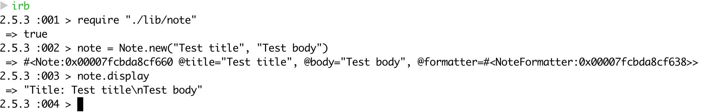

# Noted

A simple test driven notes app to demonstrate dependency injection

## How to run

Once you have forked/cloned the repo, cd in Birthdays and require the file in an irb as shown below

```
irb
require "./lib/note"
note = Note.new("Demo title", "Demo body")
note.display
```

## Screenshot of app in action

The output is simply displayed to the terminal so it may look strange with a random line break but would be fixed if the output to stdout was done using p or puts



## Running tests and linter

The following commands must be run in the root directory of the project

1. Testing: ```rspec```
2. Linter: ```rubocop```
